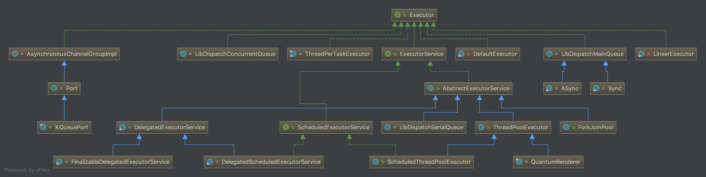

# 核心类

## 类图

##类说明

| 类名                                      | 说明                                       |
| --------------------------------------- | ---------------------------------------- |
| Executor                                |                                          |
| java.util.concurrent.Executors          | 工厂方法 Factory and utility methods for Executor, ExecutorService, ScheduledExecutorService, ThreadFactory, and Callable classes defined in this package. |
| java.util.concurrent.ThreadPoolExecutor |                                          |

## 线程状态

