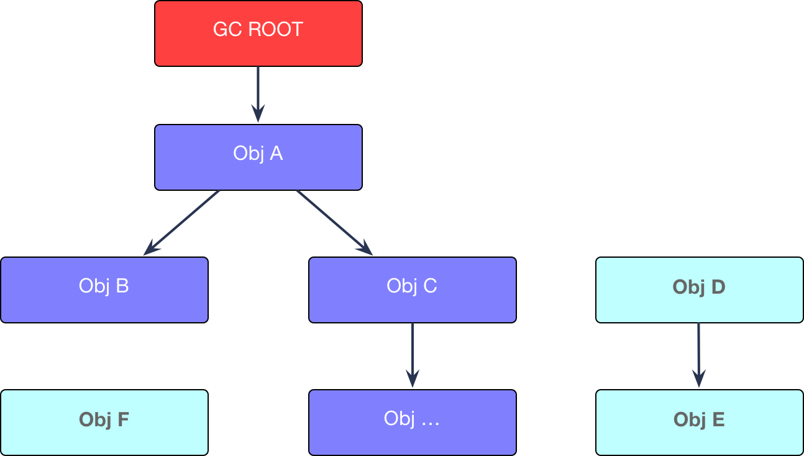

**GC为我们做了什么操作呢？**

1. 哪些内存需要回收？
2. 什么时候回收？
3. 如何回收？

# 根搜索算法(收集垃圾)

> Java1.2之前主要通过**引用计数器**来标记是否需要垃圾回收，而1.2之后都使用**根搜索算法**来收集垃圾

根搜索算法是从离散数学中的**图论**引入的，程序把所有的引用关系看作一张图，从一个节点GC ROOT开始，寻找对应的引用节点，找到这个节点以后，继续寻找这个节点的引用节点，当所有的引用节点寻找完毕之后，剩余的节点则被认为是没有被引用到的节点，即无用的节点。 (遍历图)

**目前java中可作为GC Root的对象有**

- 虚拟机栈中引用的对象（本地变量表）
- 方法区中静态属性引用的对象
- 方法区中常量引用的对象
- 本地方法栈中引用的对象（Native对象）

