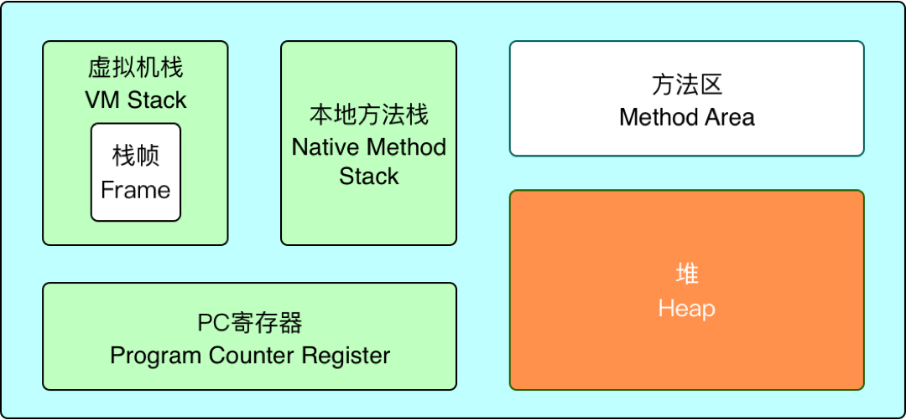
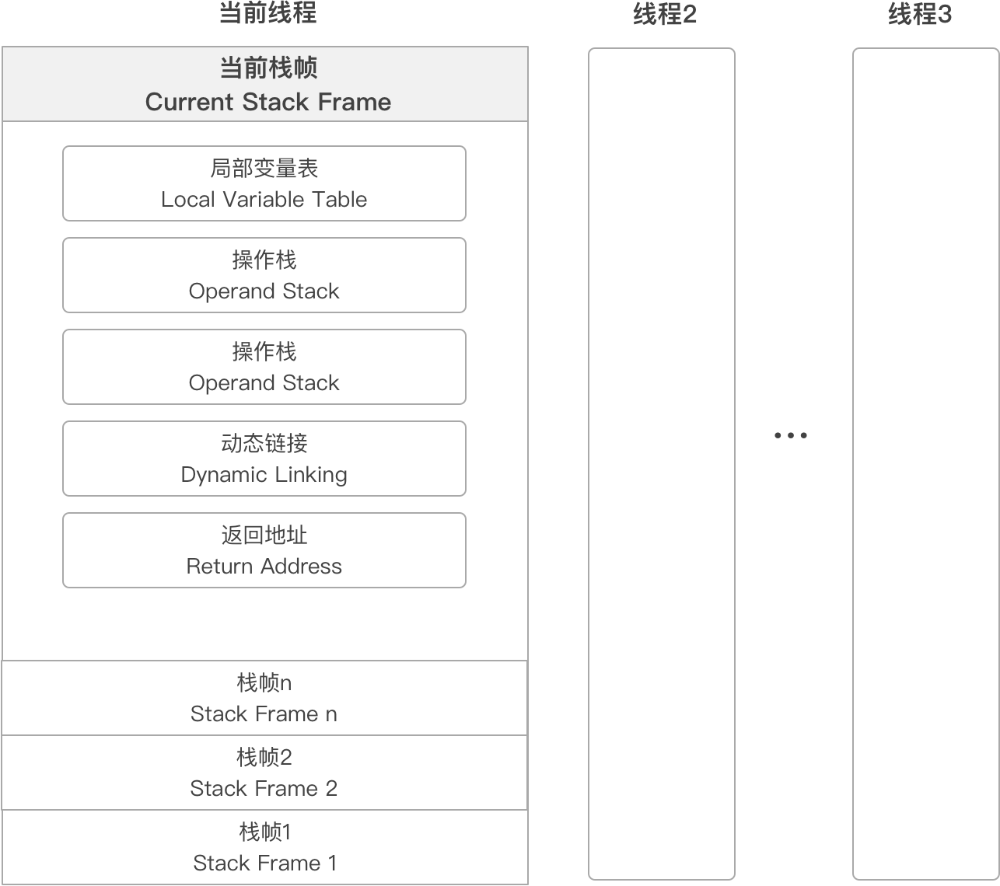

# JVM 内存模型

##虚拟机栈

1. 每个线程有一个私有的栈，随着线程的创建而创建
2. 每个方法会创建一个栈帧，栈帧中存放了局部变量表（基本数据类型和对象引用）、操作数栈、方法出口等信息
3. 栈的大小可以固定也可以动态扩展
4. 以栈帧为单位，进行压栈和出栈

## 本地方法栈

这部分主要与虚拟机用到的 Native 方法相关，一般情况下， 不需要关心这部分的内容

## PC 寄存器

> 也叫程序计数器

1. JVM支持多个线程同时运行，每个线程都有自己的程序计数器
2. 倘若当前执行的是 JVM 的方法，则该寄存器中保存当前执行指令的地址；倘若执行的是native 方法，则PC寄存器中为空
3. 线程私有，因为多线程并发回来后要恢复到当前线程之前执行的位置，所以每个线程都会独立拥有一个 PC
4. 占用空间极小

## 堆

1. 堆内存是 JVM 所有线程共享的部分，在虚拟机启动的时候就已经创建
2. 所有的对象和数组都在堆上进行分配
3. 这部分空间可通过 GC 进行回收。当申请不到空间时会抛出 OutOfMemoryError

