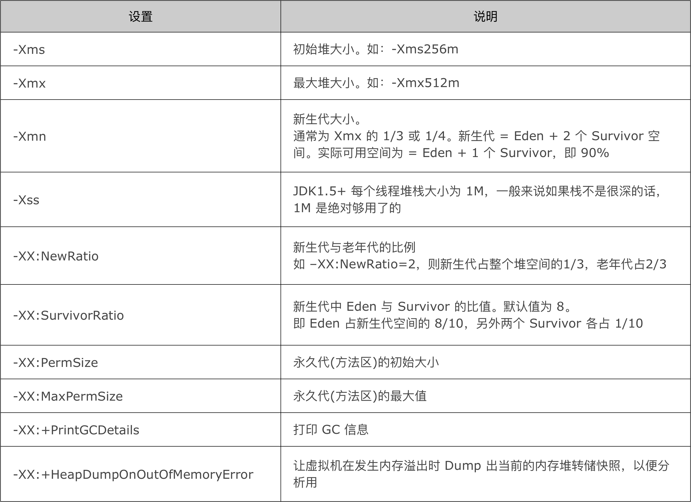

# 堆内存

> Java 中的堆是 JVM 所管理的最大的一块内存空间，主要用于存放各种类的实例对象

在 Java 中，堆被划分成两个不同的区域：==新生代 ( Young )==、==老年代 ( Old )==。

新生代 ( Young ) 又被划分为三个区域：**Eden、From Survivor、To Survivor**。这样划分的目的是为了使 JVM 能够更好的管理堆内存中的对象，包括内存的分配以及回收。
堆的内存模型大致为：


## 新生代

新生代几乎是所有 Java 对象出生的地方,即 Java 对象申请的内存以及存放都是在这个地方(大对象？？？)

## 年老代

老年代里面的对象几乎个个都是在 Survivor 区域中熬过来的，它们是不会那么容易就 "死掉" 了的。因此，Full GC 发生的次数不会有 Minor GC 那么频繁，并且做一次 Full GC 要比进行一次 Minor GC 的时间更长。

# GC 堆

Java 中的堆也是 GC 收集垃圾的主要区域。GC 分为两种：**Minor GC、Full GC ( 或称为 Major GC )**

## Minor GC

> 发生在**新生代**中的垃圾收集动作，所采用的是**复制算法**


## JVM参数



## jvm日志（jdk1.8）

```shell
[ GC [ PSYoungGen:  1351K -> 288K (18432K) ]  1351K -> 288K (59392K), 0.0012389 secs ]  [ Times: user=0.00 sys=0.00, real=0.00 secs ] 
[ Full GC (System)  [ PSYoungGen:  288K -> 0K (18432K) ]  [ PSOldGen:  0K -> 160K (40960K) ]  288K -> 160K (59392K)  [ PSPermGen:  2942K -> 2942K (30720K) ],  0.0057649 secs ] [ Times:  user=0.00  sys=0.00,  real=0.01 secs ] 

[ GC [ PSYoungGen:  2703K -> 1056K (18432K) ]  2863K -> 1216K(59392K),  0.0008206 secs ]  [ Times: user=0.00 sys=0.00, real=0.00 secs ] 
[ Full GC (System)  [ PSYoungGen:  1056K -> 0K (18432K) ]  [ PSOldGen:  160K -> 1184K (40960K) ]  1216K -> 1184K (59392K)  [ PSPermGen:  2951K -> 2951K (30720K) ], 0.0052445 secs ]  [ Times: user=0.02 sys=0.00, real=0.01 secs ] 

Heap
 PSYoungGen      total 18432K, used 327K [0x00000000fec00000, 0x0000000100000000, 0x0000000100000000)
  eden space 16384K, 2% used [0x00000000fec00000,0x00000000fec51f58,0x00000000ffc00000)
  from space 2048K, 0% used [0x00000000ffe00000,0x00000000ffe00000,0x0000000100000000)
  to   space 2048K, 0% used [0x00000000ffc00000,0x00000000ffc00000,0x00000000ffe00000)
 PSOldGen        total 40960K, used 1184K [0x00000000fc400000, 0x00000000fec00000, 0x00000000fec00000)
  object space 40960K, 2% used [0x00000000fc400000,0x00000000fc5281f8,0x00000000fec00000)
 PSPermGen       total 30720K, used 2959K [0x00000000fa600000, 0x00000000fc400000, 0x00000000fc400000)
  object space 30720K, 9% used [0x00000000fa600000,0x00000000fa8e3ce0,0x00000000fc400000)
```

### 日志说明


# 参考

[http://www.blogjava.net/fancydeepin/archive/2013/09/29/jvm_heep.html](http://www.blogjava.net/fancydeepin/archive/2013/09/29/jvm_heep.html)