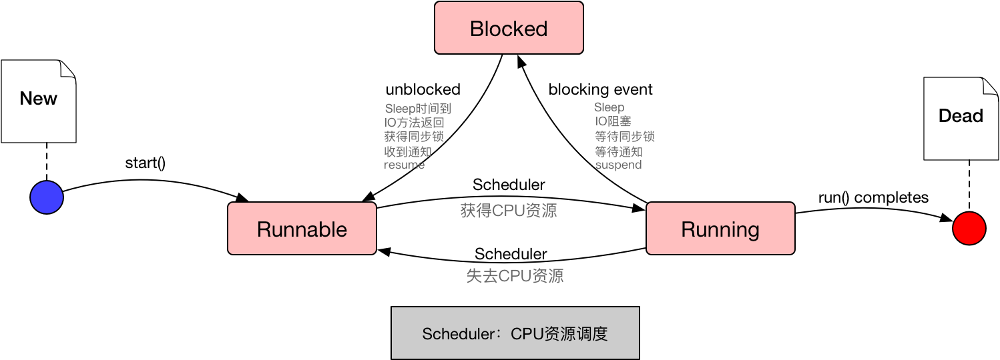

# 生命周期

## 线程状态

**`创建状态`、`可运行状态`、`不可运行状态`、`消亡状态`**

## 创建状态（New）

1. 当用new操作符创建一个新的线程对象时，该线程处于创建状态。
2. 处于创建状态的线程只是一个空的线程对象，系统不为它分配资源。仅仅是由Java虚拟机为其分配内存，并初始化其成员变量的值

注意：

> 启动线程使用start()方法，而不是run()方法。==永远不要调用线程对象的run()方法==。
>
> 调用start方法来启动线程，系统会把该run()方法当成线程执行体来处理；但如果直按调用线程对象的run()方法，则run()方法立即就会被执行，而且在run()方法返回之前其他线程无法并发执行。
>
> 也就是说，系统把线程对象当成一个普通对象，而run()方法也是一个普通方法，而不是线程执行体。需要指出的是，调用了线程的run()方法之后，该线程已经不再处于新建状态，不要再次调用线程对象的start()方法。只能对处于新建状态的线程调用start()方法，否则将引发IllegaIThreadStateExccption异常。

## 可运行状态（Runnable）

当线程对象调用了**start()**方法之后，该线程处于就绪状态（Runnable）。Java虚拟机会为其创建方法调用栈和程序计数器，等待调度运行

这一状态并不是运行中状态（**Running**），因为线程也许实际上并未真正运行。

## 运行状态（Running）

如果处于就绪状态的线程获得了CPU，开始执行run()方法的线程执行体，则该线程处于运行状态

## 不可运行状态（Blocked）

**当发生下列事件时，处于运行状态的线程会转入到不可运行状态：**

- 线程调用**sleep()**方法==主动放弃==所占用的处理器资源
- 线程输入/输出阻塞: 线程调用了一个**阻塞式IO方法**，在该方法返回之前，该线程被阻塞
- 线程试图获得一个**同步监视器**，但该同步监视器正被其他线程所持有
- 线程在等待某个通知（notify）
- 程序调用了线程的**suspend()**方法将该线程挂起。但这个方法容易导致死锁，所以应该尽量避免使用该方法
- 线程调用**wait()**方法等待特定条件的满足

> 当前正在执行的线程被阻塞之后，其他线程就可以获得执行的机会。被阻塞的线程会在合适的时候重新进入就绪状态，注意是就绪状态而不是运行状态。也就是说，被阻塞线程的阻塞解除后，必须重新等待线程调度器再次调度它。

**返回可运行状态：**

- 处于睡眠状态的线程在指定的时间过去后；
- 如果线程在等待某一条件，另一个对象必须通过notify()或notifyAll()方法通知等待线程条件的改变；
- 如果线程是因为输入输出阻塞，等待输入输出完成。

## 消亡状态（Dead）

当线程的run()方法执行结束后，该线程自然消亡。

# 线程的优先级

