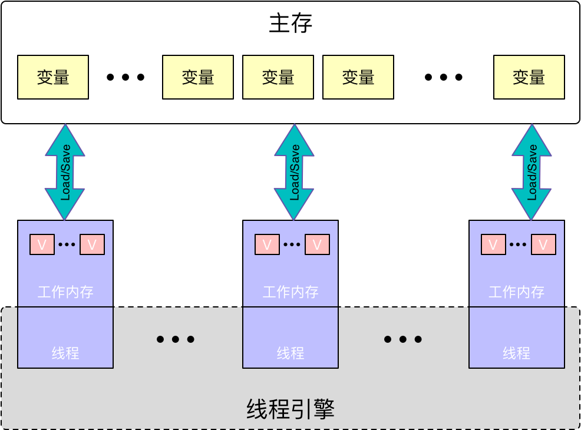
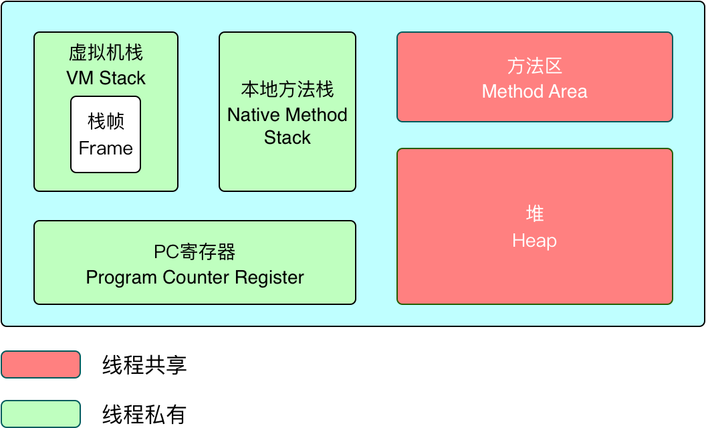
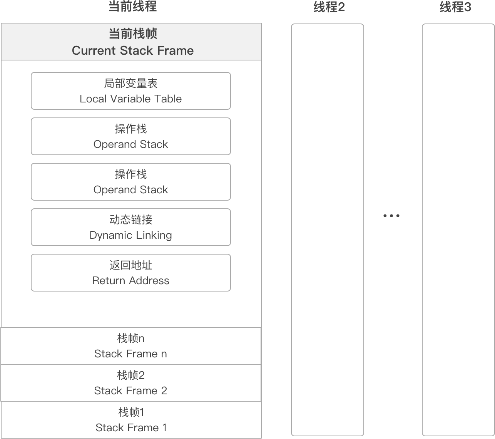
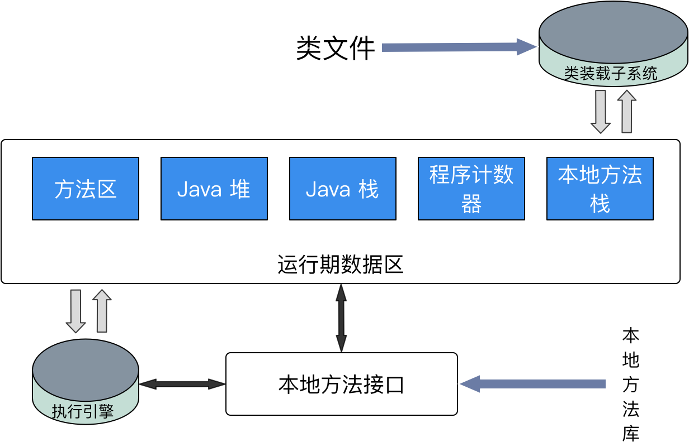

[TOC]



# Java内存

**JVM运行时数据区**



## PC寄存器

> 也叫程序计数器（Program Counter Register），它的作用是指向当前线程所执行的字节码的**行号指示器(指令地址)**。对于抢占CPU资源后，回来后需要得到指令继续执行

1. JVM支持多个线程同时运行，每个线程都有自己的程序计数器
2. 倘若当前执行的是 JVM 的方法，则该寄存器中保存当前执行指令的地址；倘若执行的是native 方法，则PC寄存器中为空
3. ==线程私有==，因为多线程并发回来后要恢复到当前线程之前执行的位置，所以每个线程都会独立拥有一个 PC
4. 占用空间极小

## 虚拟机栈

> 当前线程运行方法所需要的**数据、指令、返回地址**



1. 每个线程有一个==私有==的栈，随着线程的创建而创建
2. 每个方法会创建一个栈帧，栈帧中存放了局部变量表（基本数据类型和对象引用）、操作数栈、方法出口等信息
3. 栈的大小可以固定也可以动态扩展
4. 以栈帧为单位，进行压栈和出栈

### 局部变量表

> 局部变量表所需的内存空间在**编译期间完成分配**
>
> 当进入一个方法时，这个方法需要在帧中分配多大的局部变量空间是完全确定的，在方法运行期间不会改变局部变量表的大小

**存储内容：**

1. 编译期可知的各种基本数据类型（boolean、byte、char、short、int、float、long、double）
2. 对象引用（reference 类型，它不等同于对象本身，根据不同的虚拟机实现，它可能是一个指向对象起始地址的引用指针，也可能指向一个代表对象的句柄或者其他与此对象相关的位置）
3. returnAddress 类型（指向了一条字节码指令的地址）

## 本地方法栈

这部分主要与虚拟机用到的 Native 方法相关，一般情况下， 不需要关心这部分的内容

## 堆区（Heap）

> Java 堆是被所有线程共享的一块内存区域,在虚拟机启动时创建。此内存区域的唯一目的就是**存放对象实例**，几乎所有的对象实例都在这里分配内存

1. 堆内存是 JVM 所有线程共享的部分，在虚拟机启动的时候就已经创建
2. 所有的对象和数组都在堆上进行分配
3. 这部分空间可通过 GC 进行回收。当申请不到空间时会抛出 OutOfMemoryError

[详细内容](jvmheap.md)

## 方法区（Method Area）

> Method Area

### 特点

1. ==线程共享==
2. 又称为 Non-Heap，用来和堆进行区分
3. **用于存储已被虚拟机加载的==类信息==、==常量==、==静态变量==、==JIT(即时编译后的代码)==等数据**
4. [HotSpot](https://github.com/rexwong/java-doc/blob/master/src/main/java/com/rexwong/jvm/HotspotJVM.md) 虚拟机把 GC 分代收集扩展至方法区，所以在 HotSpot 可以称它为永久代（Permanent Generation）

### 方法区的大小的分配

- -XX:MaxPermSize 最大值,上限
- -XX:PermSize 最小值

```shell
-XX:MaxPermSize=10M -XX:PermSize=10M
```

## 直接内存

> 直接内存并不是虚拟机运行时数据区的一部分。

在NIO中，引入了一种基于通道和缓冲区的I/O方式，它可以使用native函数直接分配堆外内存，然后通过一个存储在java堆中的DirectByteBuffer对象作为这块内存的引用进行操作。

**-XX:MaxDirectMemorySize**设置最大值，默认与java堆最大值一样。

```shell
-XX:MaxDirectMemorySize=10M -Xmx20M
```


# 类加载



类的加载：加载、连接（验证、准备、解析）、初始化、使用、卸载

Class 保存类的定义或者结构   堆中

初始化：执行类的构造器<cinit>,为类的静态变量赋予正确的初始值

构造器：jvm加载class文件  

1. static 变量
2. static{} 语句

构造方法  实例化对象

##  双亲委派模型

避免类的重复加载

## ClassLoader

JDK已有的类加载器： 

- **Boostrap ClassLoader** —>主要加载rt.jar
- **Extension ClassLoader** extends ClassLoader —>%JAVA_HOME%/lib/ext/*.jar
- **App Classloader** extends ClassLoader   —>Classpath

自定义类加载器 extends ClassLoader  —>自定义路径

# 参考

[http://www.cnblogs.com/zhguang/p/3257367.html](http://www.cnblogs.com/zhguang/p/3257367.html)

