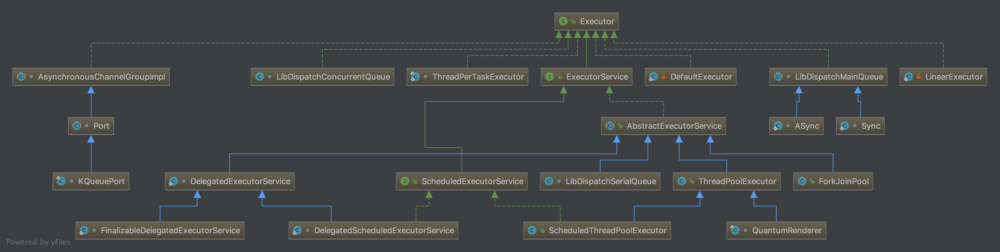

# 核心类

## 类图

##类说明

| 类名                                      | 说明                                       |
| --------------------------------------- | ---------------------------------------- |
| Executor                                |                                          |
| java.util.concurrent.Executors          | 工厂方法 Factory and utility methods for Executor, ExecutorService, ScheduledExecutorService, ThreadFactory, and Callable classes defined in this package. |
| java.util.concurrent.ThreadPoolExecutor |                                          |

## 线程状态

1. **RUNNING**:  

   > Accept new tasks and process queued tasks

2. **SHUTDOWN**: 

   > Don't accept new tasks, but process queued tasks

3. **STOP**:     

   > Don't accept new tasks, don't process queued tasks,and interrupt in-progress tasks

4. **TIDYING**: 

   > All tasks have terminated, workerCount is zero,the thread transitioning to state TIDYING will run the terminated() hook method

5. **TERMINATED**:

   > ==terminated()== has completed

